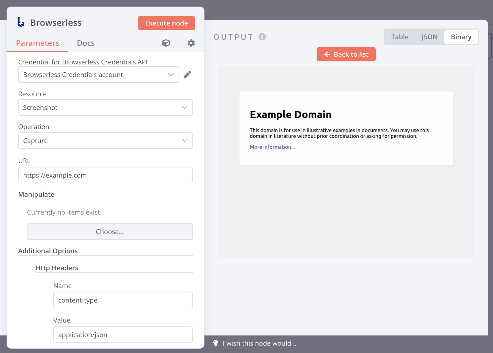

# n8n-nodes-browserless

This is an n8n community node. It lets you use browserless in your n8n workflows.

Fast, scalable, and reliable web browser automation. Make web automation your competitive advantage, not a liability.

[n8n](https://n8n.io/) is a [fair-code licensed](https://docs.n8n.io/reference/license/) workflow automation platform.

[Installation](#installation)  
[Operations](#operations)  
[Credentials](#credentials)  <!-- delete if no auth needed -->  
[Compatibility](#compatibility)  
[Usage](#usage)  <!-- delete if not using this section -->  
[Resources](#resources)  
[Version history](#version-history)  <!-- delete if not using this section -->  

## Installation

Follow the [installation guide](https://docs.n8n.io/integrations/community-nodes/installation/) in the n8n community nodes documentation.

add comunitity node`n8n-node-browserless` to your `n8n` platform 

## Operations

- [Get page's content](https://www.browserless.io/docs/content)
- [Execute custom Function](https://www.browserless.io/docs/function)
- [Generate page as pdf](https://www.browserless.io/docs/pdf)
- [Capture page's screenshot](https://www.browserless.io/docs/screenshot)
- [Scrape page as json](https://www.browserless.io/docs/scrape)
## Credentials

This node require a browserless `url` and `token` in order to connect to your `browserless` account or out self-hosted borwserless instance.

## Compatibility

I am develop the node on `n8n@0.200.1`. I don't have the change to test on other versions yet.

## Usage

- Add `browserless` node into your workflow

- Set up your node 

## Resources

* [n8n community nodes documentation](https://docs.n8n.io/integrations/community-nodes/)
* [Browserless home page](https://www.browserless.io/)
* [Browserless API docs](https://www.browserless.io/docs/api)
* [Browserless self-hosted quick start](https://www.browserless.io/docs/docker-quickstart)

## Version history

- `0.0.1` initital release

